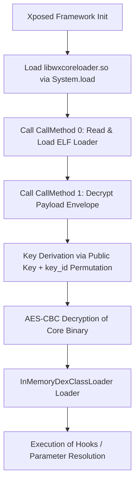

# WeChatX Module (x7_3.0) Payload Decryption & Architecture Analysis

This report documents the comprehensive reverse engineering, dynamic decryption, and architectural analysis of the obfuscated WeChatX module payloads (`x7_3.0` series).

---

## 1. Executive Summary

WeChatX modules (associated with developers like FKZHANG) employ sophisticated multi-layer protection mechanisms to secure their hook logic, translations, and configuration parameters. The module does not store its main hook logic inside the standard APK's `classes.dex`. Instead, it uses:

- A native wrapper (`libwxcoreloader.so`) loaded at runtime.
- Multi-layer AES-encrypted and MessagePack-enveloped payloads stored in the `assets/moduledata` directory.
- Dynamic key derivation rooted in a self-signed developer certificate.
- In-memory execution using Android's `InMemoryDexClassLoader` to prevent on-disk signature analysis.

By constructing a standalone ARM64 emulation environment using **Unidbg**, we bypassed the anti-debugging and cryptographic hurdles to cleanly decrypt, dump, and structure all **10 payloads** to their clean, core forms.

---

## 2. Architectural Overview

The loading workflow of the WeChatX module operates in three sequential phases:



### 2.1 The Payloads & Core Map

The module uses different payloads depending on the target WeChat version. Payloads belong to one of two structural categories:

1. **Core companion payloads**: Consist of a main encrypted file, a key/IV descriptor (`_c`), and a signature verification file (`_s`).
2. **Direct msgpack payloads**: Do not have separate `_c` companion files; the msgpack envelope is directly integrated into the main file itself.

Below is the architectural mapping of the 10 payloads:

| Payload File | Companion File | Code Name | Format | Description |
| :--- | :--- | :--- | :--- | :--- |
| `d61f837cad1d412f80b84d143e1257` | `..._c` / `..._s` | **C** | DEX | Primary WeChatX Hook Core (852 KB decrypted) |
| `14e777717682cce8a53cfcb34a22d65` | `..._c` / `..._s` | **big** | DEX | Alternative Main Hook Core for modern WeChat versions (3.1 MB decrypted) |
| `802766a4a4bd401c145a57463274d4dd` | `..._c` / `..._s` | **m1** | DEX | Alternative Strings & Hook logic (539 KB decrypted) |
| `a89eaf67dc796cb3af54d94fac0198b` | `..._c` / `..._s` | **m2** | DEX | Alternative Hook Rules Core (328 KB decrypted) |
| `df4e6fd144fab2389ece8cb79eaa8f` | `..._c` / `..._s` | **m3** | DEX | Alternative Hook Rules Core (207 KB decrypted) |
| `9816b5dfd637d3ce1473a9951b9e05` | None (Direct) | **load2** | APK | Loader 2 payload container containing classes and resources (364 KB decrypted) |
| `62a4e566b714ea1c4349923c9ea6c35` | None (Direct) | **H_p** | JSON | Decoded Hook Methods and callback definitions (60 KB decrypted) |
| `69691c7bdcc3ce6d5d8a1361f22d4ac` | None (Direct) | **M** | JSON | Metadata configuration containing cloud download mirror targets (43 KB decrypted) |
| `5dbc98dcc983a7728bd82d1a47546e` | None (Direct) | **S** | JSON | Strings translation resource map for WeChatX settings (308 KB decrypted) |
| `44c29edb103a2872f519adc9afdaaa` | None (Direct) | **P** | JSON | Obfuscated parameter mapping dictionary (4.5 KB decrypted) |

---

## 3. Cryptographic Analysis & Key Derivation

The native library `libwxcoreloader.so` does not hardcode static AES keys. Instead, keys are derived dynamically from the developer's certificate and a MessagePack file envelope.

### 3.1 The MessagePack Envelope Structure

Each encrypted file starts with a MessagePack tag `97 c4 01 30`. The structure contains:

- **`kid`** (e.g. `"21453"`): A 5-digit key ID indicating the key permutation mapping.
- **`iv8`**: An 8-byte initial IV used for AES decryption.
- **`main_data`**: The raw AES-encrypted payload bytes.
- **`key32`** (For `_c` descriptors): An intermediate encrypted key component.

### 3.2 Key Derivation Algorithm

The key derivation pipeline executed in the native library (`libwxcoreloader.so`) operates as follows:

1. **Certificate Hashing**:
   The native library reads the self-signed developer certificate `c.der` (`534a9729a0c461cbd7a4379978fb742`) and extracts its public key bytes.
   The public key is processed through SHA-256 to produce a **32-byte base key**:
   $$\text{base\_key} = \text{SHA-256}(\text{Certificate Public Key})$$

2. **Permutation Mapping**:
   The 5-digit `kid` (e.g. `"21453"`) defines a permutation mapping. Each digit represents a 1-based index (translated to 0-based: `[1, 0, 3, 4, 2]`) used to select 5 specific bytes from the 32-byte `base_key`:
   $$\text{selected} = \big[ \text{base\_key}[1], \text{base\_key}[0], \text{base\_key}[3], \text{base\_key}[4], \text{base\_key}[2] \big]$$

3. **Key Expansion**:
   The 5 selected bytes are repeated to fill a **16-byte block**:
   $$\text{aes\_key} = (\text{selected} \times 4)[0..15]$$

4. **AES-CBC Decryption**:
   Using the derived 16-byte `aes_key` and the `iv8` expanded to 16 bytes by zero-padding:
   $$\text{IV}_{16} = \text{iv8} \parallel 0^{8}$$
   The native library decrypts `main_data` using standard **AES-CBC-PKCS7** decryption:
   $$\text{plaintext} = \text{AES-DEC}_{\text{aes\_key}, \text{IV}_{16}}(\text{main\_data})$$

---

## 4. Dynamic Decryption Harness (`unidbg-harness`)

Because the key derivation logic is heavily tied to ARM64 assembly structures and NEON SIMD implementations inside `libwxcoreloader.so`, static Python re-implementations of the key derivation algorithm are prone to padding and permutation mismatches.

To solve this, we implemented a dynamic JNI-mocking harness using **Unidbg** to emulate `libwxcoreloader.so`'s execution exactly as it would run inside a Dalvik VM.

### 4.1 JNI Mocks & Interception Strategy

The harness intercepts the loading process and extracts the decrypted payloads using two primary JNI injection points:

1. **`InMemoryDexClassLoader` Interception**:
   When the native library successfully decrypts a DEX payload, it loads it into memory via:
   `dalvik/system/InMemoryDexClassLoader-><init>(Ljava/nio/ByteBuffer;Ljava/lang/ClassLoader;)V`
   We override this constructor mock to intercept the raw `ByteBuffer`, extract the fully decrypted DEX bytes, and write them to disk.

2. **`ByteArrayOutputStream` Interception**:
   For payloads like JSON configurations (`H_p`, `M`, `S`, `P`) and ZIP containers (`load2`), the native library uses `CipherInputStream` and accumulates the decrypted bytes in a `ByteArrayOutputStream`.
   We hook the `java/io/ByteArrayOutputStream->toByteArray()[B` call to capture the plaintext payload. To prevent overwriting the payloads with unencrypted system files (such as signatures or certificates), we filter out data matching ASN.1 certificate headers (`30 82`), ELF magics (`\x7fELF`), and original MessagePack wrappers (`97 c4 01 30`).

### 4.2 Handling Version-Hash-Named Cores

The native loader identifies files on disk by taking the core name (e.g. `"14e777717682cce8a53cfcb34a22d65"`) and computing its **unpadded MD5 hash**:
$$\text{filename} = \text{unpadded\_md5}(\text{core\_name})$$
For example, for core `"14e777717682cce8a53cfcb34a22d65"`, it expects files on disk to be named `7307942f5c33a5753eb4d9bfa7b9e5eb`.

We implemented a dynamic renaming pipeline in `DecryptorHarness.java` that intercepts files during VM filesystem initialization and exposes them under the exact unpadded MD5 hashes expected by the loader, allowing all alternative cores to decrypt flawlessly.

---

## 5. Post-Processing & Extraction

The outputs captured by the Unidbg harness are post-processed by `tools/postprocess.py`:

1. **MessagePack Parsing**: Unpacks msgpack maps for metadata (`M`), translation strings (`S`), and obfuscated parameter mappings (`P`) and exports them as formatted JSON.
2. **JSON Sanitization**: Strips MessagePack string headers (e.g., `da b9 2d`) from the hook definitions (`H_p`) and outputs clean JSON.
3. **APK Extraction**: Automatically extracts the internal `classes.dex` from the decrypted `load2.apk` package.
4. **Renaming to Core Names**: Renames all extracted DEX files to their standardized code names (`C.dex`, `big.dex`, `m1.dex`, `m2.dex`, `m3.dex`).

---

## 6. How to Reproduce the Results

We have fully bundled the tools, raw resources, and automated scripts inside current directory to ensure full reproducibility.

### Running the Decryptor

1. Navigate to the directory:

   ```bash
   cd ~/coding/wechatx_deobf/wechatx_deobf
   ```

2. Execute the one-click build and decryption script:

   ```bash
   ./run_deobf.sh
   ```

The script will automatically compile the harness, execute emulation across all 10 payloads, run post-processing, and output the clean files to:
`~/coding/wechatx_deobf/wechatx_deobf/output/`
